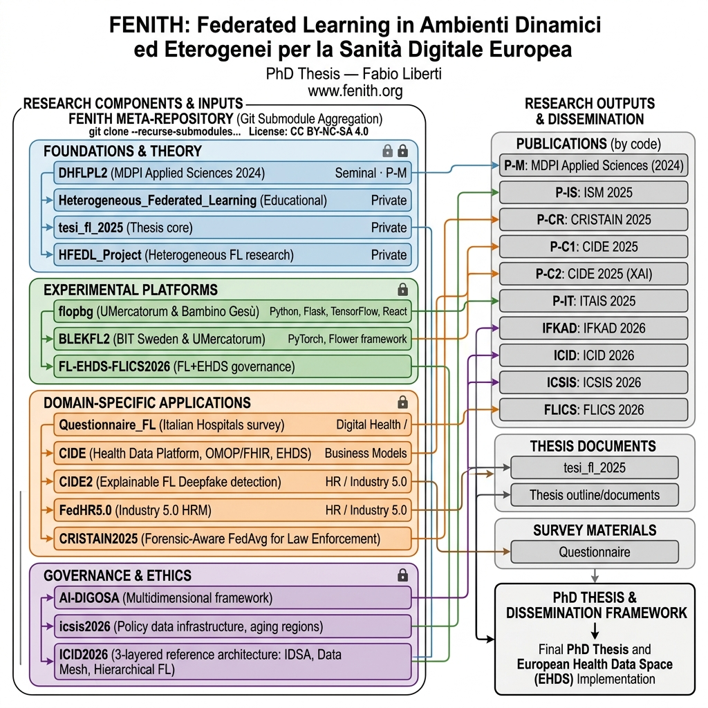
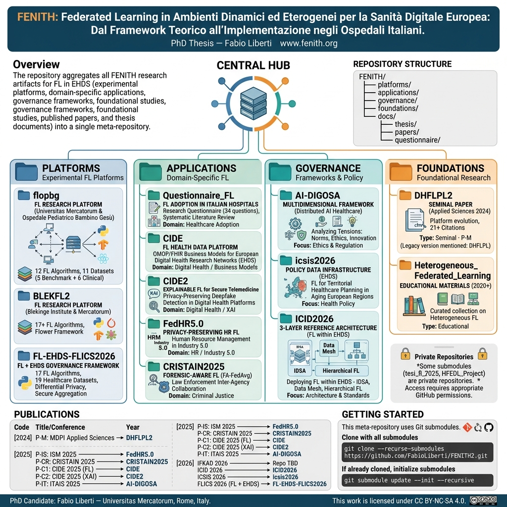
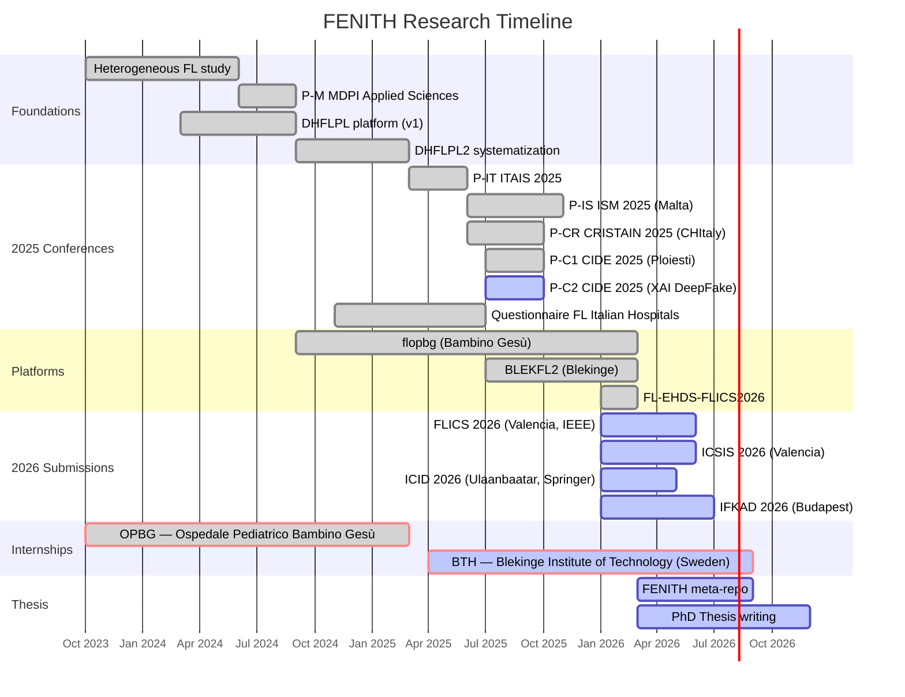

<p align="center">
  <a href="https://www.fenith.org/">
    
  </a>
</p>

<h1 align="center">FENITH</h1>

<p align="center">
  <strong>Federated Learning in Dynamic and Heterogeneous Environments for European Digital Healthcare:<br>From Theoretical Framework to Implementation in Italian Hospitals</strong>
</p>

<details align="center">
<summary><em>Titolo originale (IT)</em></summary>
<p><strong>Federated Learning in Ambienti Dinamici ed Eterogenei per la Sanità Digitale Europea:<br>Dal Framework Teorico all'Implementazione negli Ospedali Italiani</strong></p>
</details>

<p align="center">
  PhD Thesis — Fabio Liberti<br>
  <a href="https://www.fenith.org/">www.fenith.org</a>
</p>

<p align="center">
  <a href="https://creativecommons.org/licenses/by-nc-sa/4.0/"></a>
  
  
  
  <a href="https://doi.org/10.3390/app14188490"></a>
  <a href="https://github.com/FabioLiberti/FENITH2/actions/workflows/links.yml"></a>
</p>

---

## Overview

This repository serves as the central hub for the PhD research project on **Federated Learning (FL)** applied to the **European Health Data Space (EHDS)**. It aggregates all research artifacts — experimental platforms, domain-specific applications, governance frameworks, foundational studies, published papers, and thesis documents — into a single, structured meta-repository.

---

## Research Questions

| | Question | Cluster |
|---|---|---|
| **RQ1** | **Technological Framework** — How to design Federated Learning architectures capable of handling the high statistical, infrastructural, and participation heterogeneity of hospital nodes, while ensuring scalability, efficiency, and reliability of distributed training? | Platforms |
| **RQ2** | **Multidimensional Governance** — Which governance models can balance technological innovation, regulatory compliance (GDPR/EHDS), economic sustainability, and socio-ethical principles, enabling federated trust networks in healthcare? | Governance |
| **RQ3** | **Practical Adoption** — What are the main barriers and enabling conditions for the effective adoption of Federated Learning in Italian hospitals, in technological, organizational, and cultural terms? | Applications |
| **RQ4** | **EHDS Interoperability** — How can Federated Learning be integrated with international healthcare standards (HL7/FHIR, OMOP/OHDSI) to ensure full compatibility with the European Health Data Space? | Platforms · Governance |

<details>
<summary><em>Research Questions (IT)</em></summary>

| | Domanda | Cluster |
|---|---|---|
| **RQ1** | **Framework Tecnologico** — Come progettare architetture di Federated Learning in grado di gestire l'elevata eterogeneità statistica, infrastrutturale e di partecipazione dei nodi ospedalieri, assicurando scalabilità, efficienza e affidabilità del training distribuito? | Platforms |
| **RQ2** | **Governance Multidimensionale** — Quali modelli di governance possono bilanciare innovazione tecnologica, conformità normativa (GDPR/EHDS), sostenibilità economica e principi etico-sociali, abilitando reti federate di fiducia nel contesto sanitario? | Governance |
| **RQ3** | **Adozione Pratica** — Quali sono le principali barriere e condizioni abilitanti per l'adozione effettiva del Federated Learning negli ospedali italiani, in termini tecnologici, organizzativi e culturali? | Applications |
| **RQ4** | **Interoperabilità EHDS** — In che modo il Federated Learning può essere integrato con gli standard sanitari internazionali (HL7/FHIR, OMOP/OHDSI) per garantire la piena compatibilità con l'EHDS? | Platforms · Governance |

</details>

---

> See the full [architecture diagram](docs/architecture.md) for a visual overview.

<p align="center">
  
</p>

<details>
<summary><strong>Fig. 1 — FENITH Research Architecture Diagram</strong></summary>

Hierarchical map of the entire FENITH meta-repository, showing the flow from **Research Components & Inputs** (left) to **Research Outputs** (right). The diagram is organized into five color-coded layers:

- **Foundations** (grey) — DHFLPL2 (seminal paper, MDPI 2024), Heterogeneous FL educational collection, HFEDL_Project, and the private thesis repository (`tesi_fl_2025`). These feed into the experimental platforms.
- **Experimental Platforms** (blue) — Three FL research platforms: **flopbg** (TensorFlow/React, Bambino Gesù collaboration), **BLEKFL2** (PyTorch/Flower, Blekinge collaboration), and **FL-EHDS-FLICS2026** (Python, EHDS compliance framework). Each platform connects to specific conference publications on the right.
- **Domain-Specific Applications** (orange) — Five applied repositories: **Questionnaire_FL** (hospital adoption survey), **CIDE** (OMOP/FHIR business models), **CIDE2** (XAI deepfake detection), **FedHR5.0** (Industry 5.0 HR), and **CRISTAIN2025** (law enforcement FA-FedAvg). Each is mapped to its corresponding conference paper.
- **Governance & Ethics** (green) — Three governance-focused repositories: **AI-DIGOSA** (ethics/regulation tensions), **icsis2026** (health policy infrastructure), and **ICID2026** (EHDS reference architecture with IDSA/Data Mesh).
- **Research Outputs** (right column) — All 10 publications (P-M through IFKAD), thesis documents, survey materials, and the final PhD Thesis & Dissertation Framework (EHDS).

Arrows trace the lineage from foundational work through platforms and applications to published outputs.

</details>

---

<p align="center">
  
</p>

<details>
<summary><strong>Fig. 2 — FENITH Project Infographic</strong></summary>

Visual summary of the FENITH meta-repository, designed as a single-page overview with four main sections:

- **Central Hub** (top center) — Shows FENITH as the aggregation point linking all research artifacts: platforms, applications, governance frameworks, foundational studies, papers, and thesis documents. Includes the repository URL and website link.
- **Four Clusters** (middle row) — Each cluster is presented as a card with its repositories:
  - *Platforms* (teal): flopbg, BLEKFL2, FL-EHDS-FLICS2026 with their tech stacks and key metrics.
  - *Applications* (orange): Questionnaire_FL, CIDE, CIDE2, FedHR5.0, CRISTAIN2025 with domain labels.
  - *Governance* (blue): AI-DIGOSA, icsis2026, ICID2026 with focus areas.
  - *Foundations* (grey): DHFLPL2, DHFLPL, Heterogeneous_FL, plus private repos.
- **Repository Structure** (top right) — Tree view of the directory layout (`platforms/`, `applications/`, `governance/`, `foundations/`, `docs/`).
- **Publications** (bottom left) — Complete table of all 10 papers with codes, titles/conferences, years, and status. Includes DOI link for the foundational P-M paper.
- **Getting Started** (bottom right) — Clone instructions with `--recurse-submodules` and the private repo access note.
- **Footer** — Author, affiliation, license (CC BY-NC-SA 4.0).

</details>

---

## At a Glance

| | |
|---|---|
| **FL Algorithms** | 38 unique across 3 platforms (FedAvg, FedProx, SCAFFOLD, FedNova, MOON, ...) |
| **Datasets** | 35 total — 5 benchmark, 6 clinical imaging, 19 healthcare (+ 5 shared) |
| **Experiments** | 6,000+ (FL-EHDS-FLICS2026 alone) |
| **Publications** | 10 papers — 1 published (21 citations), 3 presented, 2 pending, 4 submitted |
| **Conferences** | MDPI, ISM, CRISTAIN, CIDE, ITAIS, FLICS, ICSIS, ICID, IFKAD |
| **Submodules** | 16 repositories (14 public + 2 private) |
| **Frameworks** | TensorFlow, PyTorch, Flower, Flask, React |

---

## Timeline



---

## Datasets

<details>
<summary><strong>35 datasets across 3 platforms</strong> (click to expand)</summary>

### Benchmark (5) — shared across flopbg & BLEKFL2

| Dataset | Samples | Classes | Format |
|---|---|---|---|
| MNIST | 70,000 | 10 | 28x28 grayscale |
| Fashion-MNIST | 70,000 | 10 | 28x28 grayscale |
| CIFAR-10 | 60,000 | 10 | 32x32 RGB |
| CIFAR-100 | 60,000 | 100 | 32x32 RGB |
| SVHN | 99,289 | 10 | 32x32 RGB |

### Clinical Imaging (6) — flopbg

| Dataset | Domain | Classes | Platform |
|---|---|---|---|
| Brain Tumor MRI | Neuro-imaging | 4 (glioma, meningioma, pituitary, no tumor) | flopbg |
| ISIC Skin Lesion | Dermatology | 9 (melanoma, nevus, BCC, ...) | flopbg |
| Chest X-Ray | Radiology | 2 (normal, pneumonia) | flopbg |
| Diabetic Retinopathy | Ophthalmology | 5 (no DR — proliferative) | flopbg |
| Skin Cancer | Dermatology | 2 (benign, malignant) | flopbg |
| Brain Tumor (Alt.) | Neuro-imaging | 4 | flopbg |

### Healthcare (19) — FL-EHDS-FLICS2026

**Primary evaluated (8)**

| Dataset | Domain | Samples | Compliance |
|---|---|---|---|
| PTB-XL ECG | Cardiology | 21,799 | 52 EU sites |
| Cardiovascular Disease | Cardiology | 70,000 | — |
| Diabetes 130-US Hospitals | Endocrinology/EHR | 101,766 | ICD-9 |
| Heart Disease UCI | Cardiology | 920 | 4 hospitals |
| Breast Cancer Wisconsin | Oncology | 569 | — |
| Chest X-Ray | Radiology | 5,856 | DICOM |
| Brain Tumor MRI | Neuro-imaging | 7,023 | DICOM |
| Skin Cancer (ISIC) | Dermatology | 3,297 | DICOM |

**Additionally supported (11)**

| Dataset | Domain | Samples | Compliance |
|---|---|---|---|
| Stroke Prediction | Neurology | 5,110 | — |
| CDC Diabetes BRFSS | Epidemiology | 253,680 | — |
| CKD UCI | Nephrology | 400 | — |
| Cirrhosis Mayo | Hepatology | 418 | — |
| Synthea FHIR R4 | Synthetic EHR | 1,180 | FHIR R4 |
| SMART Bulk FHIR | EHR Standards | 120 | FHIR |
| FHIR R4 Synthetic | Synthetic | configurable | FHIR R4 |
| OMOP-CDM Harmonized | Clinical Data Model | configurable | OMOP v5.4 |
| Diabetic Retinopathy | Ophthalmology | 35,126 | — |
| Brain Tumor MRI (Alt.) | Neuro-imaging | 3,264 | — |
| ISIC Skin Lesions | Dermatology | 2,357 | — |

</details>

---

## FL Algorithms

<details>
<summary><strong>38 unique algorithms across 3 platforms</strong> (click to expand)</summary>

### Core & Optimization (shared across platforms)

| Algorithm | Description | flopbg | BLEKFL2 | FL-EHDS |
|---|---|:---:|:---:|:---:|
| FedAvg | Weighted parameter averaging (McMahan et al., 2017) | Y | Y | Y |
| FedProx | Proximal regularization for non-IID data (Li et al., 2020) | Y | Y | Y |
| SCAFFOLD | Control variates for client-drift correction | Y | — | Y |
| FedNova | Normalized averaging for unequal local steps | Y | — | Y |
| FedDyn | Per-client dynamic regularizer | Y | — | Y |
| FedExP | Extrapolation-based dynamic step size (POCS) | Y | — | Y |
| FedSpeed | Proximal term with gradient perturbation correction | Y | — | Y |

### flopbg Exclusive (5)

| Algorithm | Description |
|---|---|
| MOON | Model-contrastive loss aligning local/global representations |
| FedDisco | KL-divergence weighted client contributions |
| FedLPA | Layer-wise precision-weighted (posterior) aggregation |
| DeepAFL | Frozen feature layers + ridge regression classifier |
| FedEL | Elastic layer selection with configurable budget |

### BLEKFL2 Exclusive (16)

| Algorithm | Description |
|---|---|
| FedAvg-Optimized | Enhanced FedAvg with SGD momentum, cosine annealing, AMP |
| FedLaS | Class-weighted loss with knowledge distillation |
| FedAvgM | Server-side momentum variant |
| q-FFL | Fairness-aware client weighting (Li et al., 2020) |
| NoiseAwareFL | Client filtering by data quality score |
| RobustAggregation | Outlier-robust aggregation |
| FedBN | Local batch normalization (Li et al., 2021) |
| AdaptiveFL | Drift detection with adaptive learning rate |
| ContinualFL | Continual learning with task boundaries |
| EWC | Elastic Weight Consolidation (Kirkpatrick et al., 2017) |
| MetaLearningFL | MAML-based inner/outer optimization |
| DomainGeneralizationFL | Domain-invariant feature representations |
| TransferFL | Transfer learning across domains |
| RegularizationFL | SI / MAS / L2 regularization methods |
| ReplayBasedFL | Experience and generative replay |
| ArchitecturalFL | Progressive networks, PackNet, Piggyback |

### FL-EHDS-FLICS2026 Exclusive (10)

| Algorithm | Description |
|---|---|
| FedAdam | Server-side Adam momentum |
| FedYogi | Controlled adaptive learning rate |
| FedAdagrad | Server-side gradient accumulation |
| Per-FedAvg | MAML-based meta-learning personalization |
| Ditto | L2-regularized personal model training |
| FedLC | Logit calibration for label skew |
| FedSAM | Sharpness-aware flat minima optimization |
| FedDecorr | Decorrelation against dimensional collapse |
| FedLESAM | Globally-guided sharpness-aware (ICML 2024 Spotlight) |
| HPFL | Shared backbone + personalized classifiers (ICLR 2025) |

### Byzantine Resilience (FL-EHDS-FLICS2026)

| Defense | Description |
|---|---|
| Krum / Multi-Krum | Distance-based robust aggregation |
| Trimmed Mean | Trims outlier gradients before averaging |
| Coordinate-wise Median | Per-coordinate median aggregation |
| Bulyan | Krum + trimmed mean combination |
| FLTrust | Server-guided trust scoring |

</details>

---

## Repository Structure

```
FENITH/
├── assets/              # Logo, diagrams, infographics
├── platforms/           # Experimental FL platforms (submodules)
├── applications/        # Domain-specific FL applications (submodules)
├── governance/          # Governance, policy, and ethical frameworks (submodules)
├── foundations/         # Foundational research and educational materials (submodules)
├── docs/
│   ├── thesis/          # Thesis documents and outlines
│   ├── papers/          # Published and submitted papers (see INDEX.md)
│   ├── questionnaire/   # Survey research materials
│   └── architecture.md  # Mermaid architecture diagram
├── .github/workflows/   # CI: link checker
├── CITATION.cff         # BibTeX citation for the foundational paper
├── CONTRIBUTING.md      # Contribution guidelines
├── CHANGELOG.md         # Version history
└── LICENSE              # CC BY-NC-SA 4.0
```

---

## Platforms

| Repository | Description | Stack | RQ |
|---|---|---|---|
| [flopbg](https://github.com/FabioLiberti/flopbg) | FL research platform — Universitas Mercatorum & Ospedale Pediatrico Bambino Gesù. 12 FL algorithms, 11 datasets (5 benchmark + 6 clinical). | Python, Flask, TensorFlow, React | <abbr title="Technological Framework">RQ1</abbr>, <abbr title="Practical Adoption">RQ3</abbr> |
| [BLEKFL2](https://github.com/FabioLiberti/BLEKFL2) | FL research platform — Blekinge Institute of Technology (Sweden) & Universitas Mercatorum. 17+ FL algorithms, Flower framework. | Python, Flask, PyTorch, Flower | <abbr title="Technological Framework">RQ1</abbr>, <abbr title="EHDS Interoperability">RQ4</abbr> |
| [FL-EHDS-FLICS2026](https://github.com/FabioLiberti/FL-EHDS-FLICS2026) | FL + EHDS governance framework. 17 FL algorithms, 19 healthcare datasets, differential privacy, secure aggregation. | Python | <abbr title="Technological Framework">RQ1</abbr>-<abbr title="Multidimensional Governance">2</abbr>-<abbr title="Practical Adoption">3</abbr>-<abbr title="EHDS Interoperability">4</abbr> |

## Applications

| Repository | Description | Domain | RQ |
|---|---|---|---|
| [Questionnaire_FL](https://github.com/FabioLiberti/Questionnaire_FL) | Research questionnaire on FL adoption in Italian hospitals. 34 questions, systematic literature review. | Healthcare Adoption | <abbr title="Practical Adoption">RQ3</abbr> |
| [CIDE](https://github.com/FabioLiberti/CIDE) | Federated Learning Health Data Platform - OMOP/FHIR business models for European digital health research networks (EHDS). | Digital Health / Business Models | <abbr title="Multidimensional Governance">RQ2</abbr>, <abbr title="EHDS Interoperability">RQ4</abbr> |
| [CIDE2](https://github.com/FabioLiberti/CIDE2) | Explainable Federated Learning for secure telemedicine — privacy-preserving deepfake detection in digital health platforms. | Digital Health / XAI | <abbr title="Technological Framework">RQ1</abbr>, <abbr title="Multidimensional Governance">RQ2</abbr> |
| [FedHR5.0](https://github.com/FabioLiberti/FedHR5.0) | Privacy-preserving Federated Learning framework for Human Resource Management in Industry 5.0. | HR / Industry 5.0 | — |
| [CRISTAIN2025](https://github.com/FabioLiberti/CRISTAIN2025) | FA-FedAvg — Forensic-Aware Federated Averaging for law enforcement inter-agency collaboration. | Criminal Justice | — |

## Governance

| Repository | Description | Focus | RQ |
|---|---|---|---|
| [AI-DIGOSA](https://github.com/FabioLiberti/AI-DIGOSA) | Multidimensional framework analyzing tensions between norms, ethics, and innovation in distributed AI healthcare. | Ethics & Regulation | <abbr title="Multidimensional Governance">RQ2</abbr>, <abbr title="EHDS Interoperability">RQ4</abbr> |
| [icsis2026](https://github.com/FabioLiberti/icsis2026) | FL as policy data infrastructure for territorial healthcare planning in aging European regions (EHDS). | Health Policy | <abbr title="Practical Adoption">RQ3</abbr>, <abbr title="EHDS Interoperability">RQ4</abbr> |
| [ICID2026](https://github.com/FabioLiberti/ICID2026) | Three-layered reference architecture for deploying FL within EHDS — IDSA, Data Mesh, hierarchical FL. | Architecture & Standards | <abbr title="Technological Framework">RQ1</abbr>, <abbr title="EHDS Interoperability">RQ4</abbr> |

## Foundations

| Repository | Description | Type | RQ |
|---|---|---|---|
| [DHFLPL2](https://github.com/FabioLiberti/DHFLPL2) | Foundational paper — MDPI Applied Sciences 2024 (21 citations). Systematized evolution of the FL research platform. | Seminal · P-M | <abbr title="Technological Framework">RQ1</abbr>, <abbr title="Practical Adoption">RQ3</abbr> |
| [DHFLPL](https://github.com/FabioLiberti/DHFLPL) | Original repo referenced in the published paper (v1). | Legacy · P-M | <abbr title="Technological Framework">RQ1</abbr>, <abbr title="Practical Adoption">RQ3</abbr> |
| [Heterogeneous_Federated_Learning](https://github.com/FabioLiberti/Heterogeneous_Federated_Learning) | Curated collection of educational materials on heterogeneous FL (2020+). | Educational | <abbr title="Technological Framework">RQ1</abbr> |
| tesi_fl_2025 | Thesis core repository. | Private | All |
| HFEDL_Project | Heterogeneous FL research project. | Private | <abbr title="Technological Framework">RQ1</abbr> |

---

## Publications

| Code | Title | Venue | Year | Status | Repository |
|---|---|---|---|---|---|
| P-M | Federated Learning in Dynamic and Heterogeneous Environments: Advantages, Performances, and Privacy Problems | MDPI Applied Sciences · [DOI](https://doi.org/10.3390/app14188490) | 2024 | Published (21 cit.) | [DHFLPL2](https://github.com/FabioLiberti/DHFLPL2) · ([v1](https://github.com/FabioLiberti/DHFLPL)) |
| P-IS | FedHR5.0: Privacy-Preserving HR Management in Industry 5.0 | ISM 2025 — Univ. of Malta | 2025 | -- | [FedHR5.0](https://github.com/FabioLiberti/FedHR5.0) |
| P-CR | FA-FedAvg: Forensic-Aware Federated Averaging for Law Enforcement | CRISTAIN 2025 — CHItaly | 2025 | -- | [CRISTAIN2025](https://github.com/FabioLiberti/CRISTAIN2025) |
| P-C1 | Transforming Clinical Silos into Economic Assets: Business Models for European Digital Health Research Networks | CIDE 2025 — Ploiesti | 2025 | Presented | [CIDE](https://github.com/FabioLiberti/CIDE) |
| P-C2 | Explainable Federated Learning for Secure Telemedicine: Privacy-Preserving Deepfake Detection | CIDE 2025 — Ploiesti | 2025 | -- | [CIDE2](https://github.com/FabioLiberti/CIDE2) |
| P-IT | AI Distribuita e Governance Sanitaria: Analisi Multidimensionale delle Tensioni tra Norme, Etica e Innovazione | ITAIS 2025 | 2025 | Presented | [AI-DIGOSA](https://github.com/FabioLiberti/AI-DIGOSA) |
| FLICS | FL + EHDS Governance Framework: Differential Privacy and Secure Aggregation | FLICS 2026 — Valencia · IEEE | 2026 | Submitted | [FL-EHDS-FLICS2026](https://github.com/FabioLiberti/FL-EHDS-FLICS2026) |
| ICSIS | FL as Policy Data Infrastructure for Territorial Healthcare Planning | ICSIS 2026 — Valencia | 2026 | Submitted | [icsis2026](https://github.com/FabioLiberti/icsis2026) |
| ICID | Three-Layered Reference Architecture for FL within EHDS | ICID 2026 — Ulaanbaatar · Springer | 2026 | Submitted | [ICID2026](https://github.com/FabioLiberti/ICID2026) |
| IFKAD | FedHR5.0: Federated Learning for Knowledge Asset Dynamics in Industry 5.0 | IFKAD 2026 — Budapest | 2026 | Submitted | *Repo TBD* |

---

## Getting Started

This meta-repository uses **Git submodules** to link all component repositories.

```bash
# Clone with all submodules
git clone --recurse-submodules https://github.com/FabioLiberti/FENITH2.git

# If already cloned, initialize submodules
git submodule update --init --recursive

# Update all submodules to their latest commit
git submodule update --remote --merge
```

> **Note:** Some submodules (`tesi_fl_2025`, `HFEDL_Project`) are private repositories. Access requires appropriate GitHub permissions.

---

## License

This work is licensed under [CC BY-NC-SA 4.0](https://creativecommons.org/licenses/by-nc-sa/4.0/).

Individual submodules may have their own licenses — refer to each repository for details.

---

## Author

**Fabio Liberti**
PhD Candidate — Universitas Mercatorum, Rome, Italy

[](https://www.fabioliberti.com/)
[](https://orcid.org/0000-0003-3019-5411)
[](https://scholar.google.com/citations?user=ce_iUyEAAAAJ&hl=it)
[](https://www.researchgate.net/profile/Fabio-Liberti)

---

## Institutions & Collaborations

This research has been conducted in collaboration with the following institutions:

| Institution | Role | Period |
|---|---|---|
| **Universitas Mercatorum** — Rome, Italy | PhD Program — Home University | 2023 – present |
| **Ospedale Pediatrico Bambino Gesù (OPBG)** — Rome, Italy | Research Internship — Clinical FL platforms and healthcare datasets | Oct 2023 – Mar 2025 |
| **Blekinge Institute of Technology (BTH)** — Karlskrona, Sweden | Research Internship — Heterogeneous FL and international collaboration | Apr 2025 – Sep 2026 |

---

## Acknowledgements

This PhD research was carried out under the supervision of:

- **Prof. Barbara Martini** — Universitas Mercatorum *(thesis supervisor)*
- **Prof. Andrea Mazzitelli** — Universitas Mercatorum *(co-supervisor)*

The author gratefully acknowledges the contributions of:

- **Prof. Davide Berardi** — Universitas Mercatorum, for the collaboration on the foundational Federated Learning research.
- **Prof. Alberto Eugenio Tozzi** — Ospedale Pediatrico Bambino Gesù, Preventive and Predictive Diseases Research Unit, for the mentorship during the institutional research internship.
- **Prof. Sadi Alawadi** — Blekinge Institute of Technology (Sweden), for the mentorship during the international research internship.
- All the Italian hospitals that participated in the Federated Learning adoption questionnaire.

---

## Keywords

`federated-learning` · `european-health-data-space` · `ehds` · `privacy-preserving` · `differential-privacy` · `secure-aggregation` · `digital-healthcare-governance` · `heterogeneous-environments` · `dynamic-environments` · `omop-OHDSI` · `hl7-fhir` · `data-mesh` · `industry-5-0`

---
