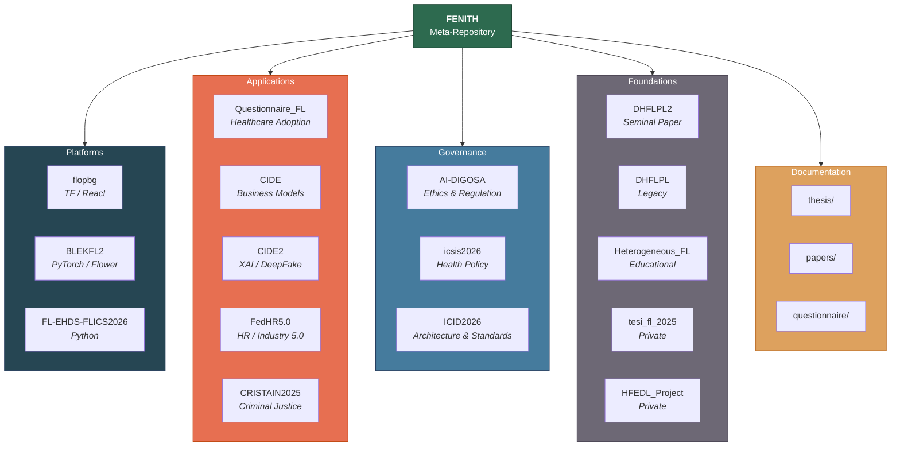

# FENITH Architecture

```mermaid
graph TB
    FENITH["<b>FENITH</b><br/>Meta-Repository"]

    subgraph Platforms["Platforms"]
        direction LR
        P1["flopbg<br/><i>TF / React</i>"]
        P2["BLEKFL2<br/><i>PyTorch / Flower</i>"]
        P3["FL-EHDS-FLICS2026<br/><i>Python</i>"]
    end

    subgraph Applications["Applications"]
        direction LR
        A1["Questionnaire_FL<br/><i>Healthcare Adoption</i>"]
        A2["CIDE<br/><i>Business Models</i>"]
        A3["CIDE2<br/><i>XAI / DeepFake</i>"]
        A4["FedHR5.0<br/><i>HR / Industry 5.0</i>"]
        A5["CRISTAIN2025<br/><i>Criminal Justice</i>"]
    end

    subgraph Governance["Governance"]
        direction LR
        G1["AI-DIGOSA<br/><i>Ethics & Regulation</i>"]
        G2["icsis2026<br/><i>Health Policy</i>"]
        G3["ICID2026<br/><i>Architecture & Standards</i>"]
    end

    subgraph Foundations["Foundations"]
        direction LR
        F1["DHFLPL2<br/><i>Seminal Paper</i>"]
        F2["DHFLPL<br/><i>Legacy</i>"]
        F3["Heterogeneous_FL<br/><i>Educational</i>"]
        F4["tesi_fl_2025<br/><i>Private</i>"]
        F5["HFEDL_Project<br/><i>Private</i>"]
    end

    subgraph Docs["Documentation"]
        direction LR
        D1["thesis/"]
        D2["papers/"]
        D3["questionnaire/"]
    end

    FENITH --> Platforms
    FENITH --> Applications
    FENITH --> Governance
    FENITH --> Foundations
    FENITH --> Docs

    style FENITH fill:#2d6a4f,stroke:#1b4332,color:#fff
    style Platforms fill:#264653,stroke:#1d3557,color:#fff
    style Applications fill:#e76f51,stroke:#c1440e,color:#fff
    style Governance fill:#457b9d,stroke:#1d3557,color:#fff
    style Foundations fill:#6d6875,stroke:#4a4453,color:#fff
    style Docs fill:#dda15e,stroke:#bc6c25,color:#fff
```
